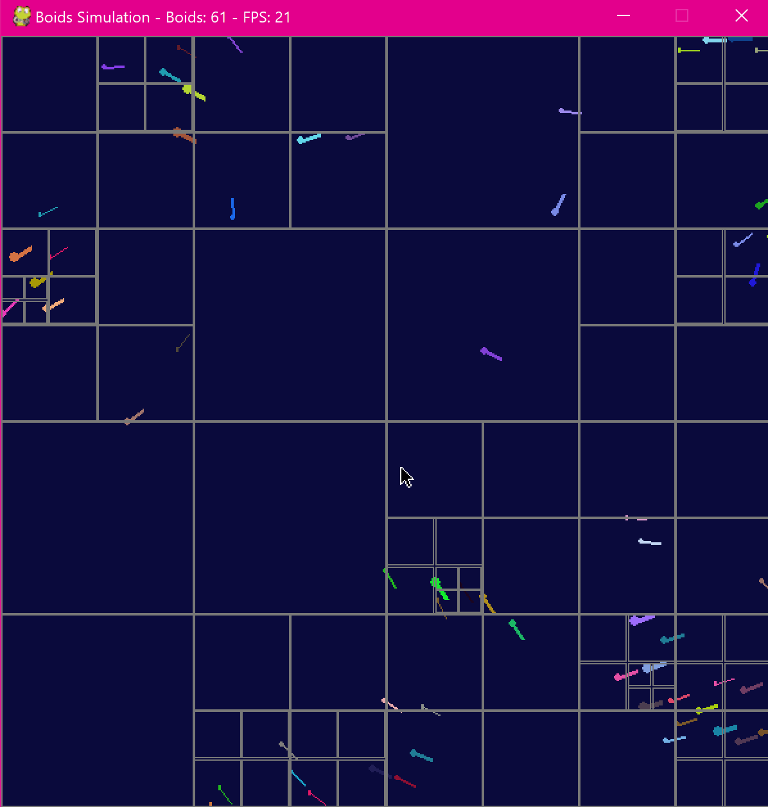

# FlockingSimulation
An implementation of Craig Reynolds's Boids flocking algorithm in Python.

To run this project, clone this repo with **git clone url**.
Then download the required pygame package with **pip install -r requirements.txt"**.
Then run it with **python main.py**.

# Demo

